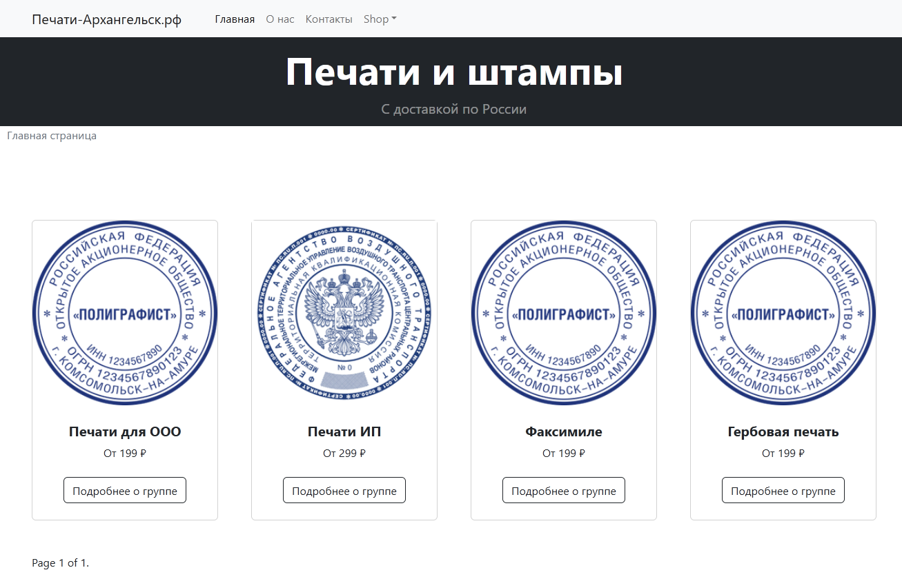

# В разработке

## Интернет магазин по продаже печатей и штампов

## Используется

### Основные зависимости
| Библиотека | Версия | Описание |
| --- | --- | --- |
| python | 3.10 | Язык программирования Python версии |
| django | 4 | Фронт на Джанго-шаблонах|
| celery | latest | Очередь задач |
| rabbitmq | latest | Брокер для celery |
| django-view-breadcrumbs | latest | "Хлебные крошки", breadcrumbs для отображения "пути". |
| django-ckeditor | 5 | Редактор теста |
| python-slugify | latest | Транслитерация текста |
| Poetry | latest | Пакетный менеджер, Альтернатива pip |
| Environs[django] | latest | Для хранения секретов в файле `.env` |
| django-json-widget| latest | Для удобного просмотра и редактирования JSONField|
| django-crispy-forms(c crispy_bootstrap5) | latest | Для Генерации форм |
| bootstrap | 5 | CSS |
| pillow | latest| images |
| sorl-thumbnail | latest| images thumbnails |
| django-ckeditor-5 | 5 | Редактор текста для админки |
| django-dirtyfields | latest | Отслеживание изменений в объекте модели, до сохранения в БД.|

### dev зависимости
| Библиотека | Версия | Описание |
| --- | --- | --- |
| pre-commit | latest | Автоматический запуск black, isort, flake8 при использование git commit |
| black, isort, flake8 | latest | Code Style |
| django-debug-toolbar | latest | Оверлей для разработки. |

## Автор

[Sadykov Miron](https://github.com/Reagent992)

## Модель БД

Так же доступен оригинальный файл с excalidraw-формате.