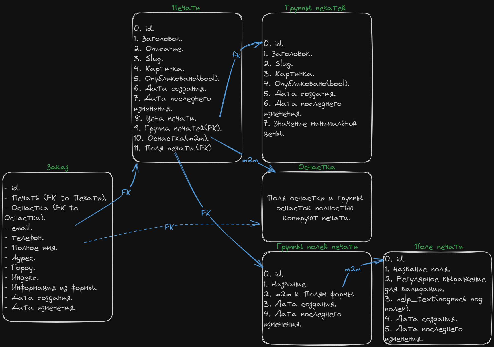

# Проект интернет-магазина по изготовлению печатей и штампов на заказ

## Описание

- Проект задумывался с целью использования, но превратился просто в учебный проект.

## Зависимости

### Основные зависимости

| Библиотека                                                                        | Описание                                                    |
| --------------------------------------------------------------------------------- | ----------------------------------------------------------- |
| python 3.10                                                                       | Язык программирования Python версии                         |
| django 4                                                                          | Фронт на Джанго-шаблонах                                    |
| celery                                                                            | Очередь задач                                               |
| rabbitmq                                                                          | Брокер для celery                                           |
| flower                                                                            | Трекер для celery задач                                     |
| django-view-breadcrumbs                                                           | "Хлебные крошки", breadcrumbs для отображения "пути".       |
| django-ckeditor 5                                                                 | Редактор теста                                              |
| python-slugify                                                                    | Транслитерация текста                                       |
| Poetry                                                                            | Пакетный менеджер                                           |
| Environs[django]                                                                  | Для хранения секретов в файле `.env`                        |
| django-json-widget                                                                | Для удобного просмотра и редактирования JSONField           |
| django-crispy-forms(c crispy_bootstrap5)                                          | Для Генерации форм                                          |
| bootstrap 5                                                                       | CSS                                                         |
| pillow                                                                            | images                                                      |
| sorl-thumbnail                                                                    | images thumbnails                                           |
| [django-ckeditor-5](https://github.com/hvlads/django-ckeditor-5)                  | Редактор текста для админки                                 |
| django-dirtyfields                                                                | Отслеживание изменений в объекте модели, до сохранения в БД |
| gunicorn                                                                          | wsgi-сервер                                                 |
| [django-split-settings](https://github.com/wemake-services/django-split-settings) | Позволяет разделять настройки на несколько файлов           |
| sentry                                                                            | Отслеживание ошибок                                         |
| [HTMX](https://htmx.org/)                                                         | Интерактивные элементы(пагинация по скролу вниз.)           |
| [django-htmx](https://github.com/adamchainz/django-htmx)                          | Middleware для работы с HTMX.                               |
| requests                                                                          | Для отправки уведомлений в Телеграм                         |

### dev зависимости

| Библиотека                                               | Описание                                                                |
| -------------------------------------------------------- | ----------------------------------------------------------------------- |
| pre-commit                                               | Автоматический запуск black, isort, flake8 при использование git commit |
| black, isort, flake8                                     | Code Style                                                              |
| django-debug-toolbar                                     | Оверлей для разработки.                                                 |
| django-stubs[compatible-mypy]                            | typehints                                                               |
| djlint                                                   | Линтер для Django-шаблонов                                              |
| selenium                                                 | Функциональные тесты                                                    |
| [Factory Boy](https://github.com/FactoryBoy/factory_boy) | Generate fake, test data                                                |
| [django-rich](https://github.com/adamchainz/django-rich) | Colourized tests outputs                                                |

## Запуск проекта

- Везде используются сокращения **dev** и **prod**.
- Используется стратегия "Merge Compose files". т.е. есть базовый `compose.yml` и он расширяется файлом `compose.override.yml` для **dev** и файлом `compose.prod.yml` для **prod**.
- Переменные окружения завязанные на dev/prod уже прописаны.

### dev

1. Запуск: `docker compose up` - запустится сразу `compose.yml` и `compose.override.yml` который расширяет его до **dev** версии.
   - Иначе: `docker compose -f ./infra/compose.yml -f ./infra/compose.override.yml --env-file=./.env up -d`
   - poetry так же ставит в venv команды `docker_dev_up` и `docker_dev_stop`.
2. Запуск `djnago runserver` и `celery worker`.\
   Для этого есть короткие команды создаваемые `poetry`: - `dwc` (django with celery) - `dr`(django run) - `cw`(celery worker)
3. Доступны management команды для создания фикстур:
   - `python manage.py fixture` - Для создания фикстур.
   - `python manage.py delete` - Для отчистки таблиц в которые были добавлены фикстуры.

- Создается superuser с **login**: admin **password**: admin\
  login и password берутся из environment variables в `compose.override.yml`, там их можно заменить.

### prod

Запуск: `docker compose -f compose.yml -f compose.prod.yml up` - базовый файл и расширяющий его. **Последовательность важна!**

- **Celery** работает в одном контейнере с **Django**, т.к. так проще, выносить ее в отдельный контейнер сейчас нету необходимости.

## Автор

[Sadykov Miron](https://github.com/Reagent992)

## Модель БД

  
Модель БД от руки

  
  Так же доступен оригинальный файл в excalidraw-формате.

  
Модель БД от pg_admin

  

